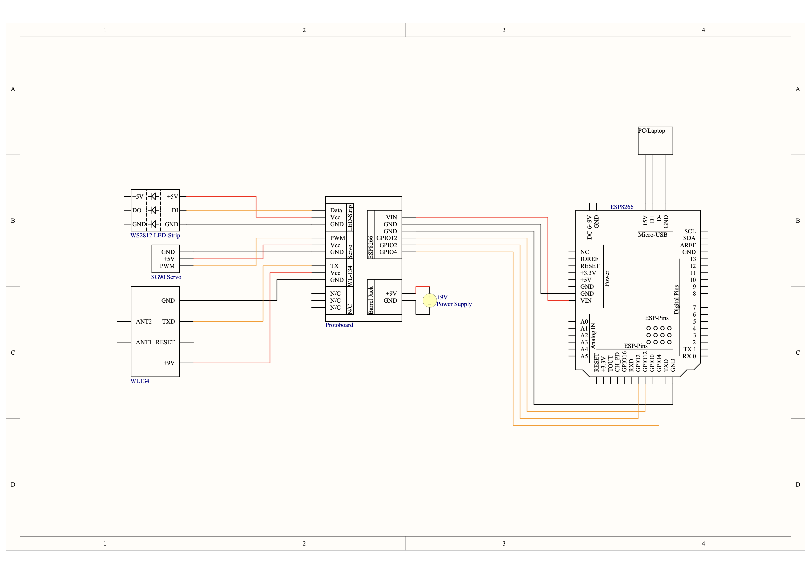

# Fischklappe v2
Das ist das Repository von einem Projekt für den Tag der offenen Türe der HTL Reutte.

## Idee
Unser Professor hatte die Idee eine Fischklappe zu bauen. 
Die Überlegung war ein Glasrohr mit einem Durchmesser von 11 cm zu nehemen und mittles 3D-Druck eine Klappe an ein Ende zu montieren. Diese sollte mit einem Servo geöffnet werden können.
In unserer Klasse sind einige Plüsch Fische verteilt gewesen. Der Gedanke war, diese Fische mit kleinen RFID-Tags zu Chipen. Dann kann an einem Ende des Glasrohres eine RFID-Empfängerspule
mit Auswertungschip angeschlossen werden und die Daten vom Fisch ausgelesen werden. Ein Mikroprozessor soll dann diese Daten verarbeiten und feststellen ob der Fisch durch die Klappe darf.
Wenn dies der Fall ist soll der Servo angesteuert werden und die Klappe auf gehen. Außerdem sollen einige LEDs von einem LED-strip in der Farbe des Fisches aufleuchten. 
Unter den Fischen war auch ein Krokodil. Bei dem sollte der LED-Strip blinken und die Klappe nicht aufgehen.

## Material 
 * Glasrohr (1.5m x Ø 11cm)
 * 3D-Drucker für die Klappe
 * ATmeg328p + ESP8266 WIFI (4Mb)
 * Wl-134 RFID-Chip
 * Sg90 180° Servo
 * (Adafruit NeoPixel WS2812 LED-Strip)
 * Adafruit NeoPixel WS2812 LED-Ring
 * Jumpers
 * Protoboard für Verkabelung und Stromversorgung

## Software
* Arduino IDE 
* VSCode
* CLion
* PyCharm
* Siemens NX (3D-Zeichnungen)
* Bamboolab Studio
* Altium Designer

## Aufbau
Das Schaltbild für die Fischklappe:

Die Fischklappe wurde zuerst auf einem Steckbrett aufgebaut und dann getestet. Dann wurde ein Protoboard entworfen und gelötet. An diesem Protoboard sind alle einzelnen Komponenten angeschlossen.
Als Stromversorgung kam ein 9V Barrel Jack Adapter zum Einsatz, da für den WL-134 9V benötigt werden. Es ist außerdem ein weiterer (noch) unbenutzter Stecker auf das Protoboard gelötet. Als Verbindung 
zwischen den Komponenten dienten Jumper Kabel in verschidenen längen.

## Microcontroller
Als Microcontroller wurde ein ESP8266 verwendet, da dieser genügend Leistung für die Anwendung hat und Wifi Kompatibel ist um diesen sowohl für die "Fisch Geschichten" als auch zum Programmieren 
von ihm genutzt wird. Das Board auf dem der Microcontroller sitzt besteht aus 2 Microcontrollern: Einem ESP8266 und einem Atmega328p (Arduino). Es sind Dipschalter auf dem Board aufgebracht um 
zu zu selektieren welcher Kommukationsweg offen ist: 

* ATmega <-> ESP8266 1100000
* USB <-> ATmega 0011000
* USB <-> ESP8266 0000111 (Update firmware)
* USB <-> ESP8266 0000110
* All independent 0000000

Diese sollten im Betrieb in der 4. Einstellung (USB <-> ESP8266) stehen, da dann auf den Seriellen Monitor zugegriffen werden kann. Wenn der ESP programiert werden soll, dann müssen diese in die 3. Einstellung 
(USB <-> ESP8266 (Update firmware)) gestellt werden. Wenn der Upload fertig ist müssen die Dipschalter wieder in die 4. Einstellung gestellt werden. Sonst würde die Firmware beim nächsten Reset gelöscht werden.
Der ESP kann mit dem Arduino IDE programmiert werden. Damit dies möglich ist muss das Board hinzugefügt werden. Unter File->Preferences->Additional boards manager URLs muss folgende URL hinzugefügt werden: "http://arduino.esp8266.com/stable/package_esp8266com_index.json". Dann auf OK drücken und unter dem Board Manager "esp8266" suchen. Wenn dieses Installiert ist kann unter Tools->Board:->esp8266->Generic ESP8266 Module
das Board ausgewählt werden. Wenn Code über OTA (Over The Air) uploaded werden soll, kann dies über Tools->Port->Network Ports gemacht werden. Manchmal muss der Reset Btn vor dem Upload gedrückt werden. Das standard OTA Passwort ist "admin" (Ja sehr sicher). 

## Fisch Geschichten
Es wurde zu jedem Fisch eine Geschichte geschrieben. Diese wurden dann Zusammengefasst und für jeden eine einfache Website designed. Der Microcontroller ist mit einem Netzwerk verbunden. Jeder der die Geschichten lesen will verbindet sich mit dem Netzwerk. Das Django Framework diente als Webserver der die Kommunikation zwischen der Fischklappe und den Geräten. Wenn ein Fisch an den Wl-134 gehalten wird, sendet der ESP eine API request and den webserver. Dieser sendet die ID von dem Fisch weiter an alle verbundenen Geräte. 

## 3D-Modelle
Alle 3D-Modelle wurden auf dem BambuLab P1S mit PLA 20-30% infill gedruckt.

## Quellen
https://forum.arduino.cc/t/atmega328p-esp8266-wifi-tutorial/944380
